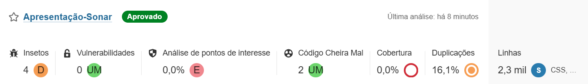

# Snyk + SonarQube
## Ferramentas de Seguranca e Qualidade no DevSecOps

**Trabalho da disciplina de Engenharia de Software — Ferramentas: **Snyk** e **SonarQube**  
Tema da aula: **DevSecOps** | Turma: **Sexta-feira**

---

## Sumario

- [Introducao](#introducao)
- [Sobre as Ferramentas](#sobre-as-ferramentas)
- [Comparativo: Snyk vs SonarQube](#comparativo-snyk-vs-sonarqube)
- [Instalacao e Configuracao](#instalacao-e-configuracao)
- [Exemplo de Demonstracao Funcional](#exemplo-de-demonstracao-funcional)
- [Resultados da Analise](#resultados-da-analise)
- [Dificuldades Encontradas](#dificuldades-encontradas)
- [Conclusao](#conclusao)
- [Referencias](#referencias)

---

## Introducao

**DevSecOps** e a pratica de integrar a seguranca ao ciclo de vida do desenvolvimento de software, desde a concepcao ate a producao. O conceito de **"Shift Left"** (deslocar para a esquerda) propoe que a seguranca seja considerada nas fases iniciais do desenvolvimento, em vez de ser uma etapa final e isolada.

Neste trabalho, exploramos duas ferramentas essenciais para o ecossistema DevSecOps: **Snyk** (focado em seguranca de dependencias e containers) e **SonarQube** (focado em qualidade e analise estatica de codigo).

> **Objetivo:** Demonstrar como essas ferramentas se complementam para garantir que o codigo seja nao apenas funcional, mas tambem seguro, limpo e de facil manutencao.

---

## Sobre as Ferramentas

### SonarQube

O **SonarQube** e uma plataforma open source criada em 2006 por Olivier Gaudin, Freddy Mallet e Simon Brandhof. Inicialmente chamado apenas de "Sonar", foi desenvolvido para preencher a lacuna de ferramentas que analisassem automaticamente a qualidade do codigo durante o desenvolvimento.

Mantido atualmente pela empresa **SonarSource**, o SonarQube realiza analise estatica de codigo, identificando:

- **Bugs:** problemas que podem causar comportamento incorreto do software.
- **Vulnerabilidades:** falhas de seguranca no codigo-fonte.
- **Code Smells:** trechos de codigo que dificultam a manutencao e compreensao.
- **Metricas:** cobertura de testes, duplicacao de codigo e divida tecnica.

> **Curiosidade:** O SonarQube suporta mais de **30 linguagens** de programacao, incluindo Java, Python, JavaScript, C#, C++, Go e TypeScript.

### Snyk

O **Snyk** e uma plataforma de seguranca nativa em nuvem, fundada em 2015 por Guy Podjarny, Assaf Hefetz e Danny Grander. A ferramenta foi criada com a filosofia **"Developer First"** (primeiro o desenvolvedor), tornando a seguranca acessivel e acionavel para quem escreve o codigo.

O Snyk atua em multiplas frentes:

- **Snyk Open Source (SCA):** Escaneia dependencias e bibliotecas de terceiros em busca de vulnerabilidades conhecidas (CVEs).
- **Snyk Code (SAST):** Analisa o codigo-fonte em busca de falhas de seguranca usando IA (DeepCode AI).
- **Snyk Container:** Verifica imagens Docker em busca de vulnerabilidades em pacotes do sistema operacional.
- **Snyk IaC:** Avalia arquivos de infraestrutura como codigo (Terraform, Kubernetes, CloudFormation).

> **Diferencial:** O Snyk e conhecido por gerar **Pull Requests automaticos** com as correcoes sugeridas para vulnerabilidades em dependencias.

---

## Comparativo: Snyk vs SonarQube

Embora ambas sejam ferramentas de seguranca, elas atuam em camadas diferentes e sao **complementares**. Enquanto o SonarQube cuida da **qualidade interna** do codigo, o Snyk protege a **cadeia de suprimentos** (dependencias externas e containers).

| Criterio | Snyk | SonarQube |
| :--- | :--- | :--- |
| **Foco principal** | Seguranca de aplicacoes (AppSec) | Qualidade de codigo + SAST |
| **Especialidade** | SCA (dependencias), containers e IaC | Analise estatica (logica, bugs, manutenibilidade) |
| **Abordagem** | "Corrija esta vulnerabilidade especifica" | "Melhore a estrutura e seguranca do seu codigo" |
| **Remediacao** | Pull Requests automaticos | Sugestoes de refatoracao |
| **Modelo** | SaaS (nuvem) ou Broker | Self-Hosted ou SaaS (SonarCloud) |
| **Plano gratuito** | Sim (com limitacoes) | Community Edition (completa) |

### Por que usar ambos?

Em um pipeline de DevSecOps maduro, as ferramentas se complementam:

- **SonarQube** -> Primeira linha de defesa. Evita que o desenvolvedor cometa erros de logica, seguranca ou boas praticas no codigo que ele mesmo escreve.
- **Snyk** -> Especialista em cadeia de suprimentos. Garante que as bibliotecas externas utilizadas nao tragam vulnerabilidades conhecidas para o projeto.

> **Cenario ideal:** **SNYK** + **SONARQUBE** trabalhando juntos no pipeline CI/CD.

---

## Instalacao e Configuracao

### Instalacao do SonarQube

Para esta demonstracao, utilizamos a versao **SonarCloud** (SaaS), dispensando a instalacao de um servidor local. O SonarCloud e gratuito para repositorios publicos e se integra nativamente ao GitHub.

**Passos realizados:**

1. Acessar [sonarcloud.io](https://sonarcloud.io) e fazer login com a conta GitHub.
2. Clicar em **"Analyze new project"** e selecionar o repositorio desejado.
3. Configurar o **Quality Gate** (criterios minimos de qualidade).
4. Obter o **SONAR_TOKEN** para integracao com o pipeline.

```yaml
# Exemplo de configuracao no GitHub Actions
- name: SonarQube Scan
  uses: SonarSource/sonarcloud-github-action@v2
  env:
    SONAR_TOKEN: ${{ secrets.SONAR_TOKEN }}
  with:
    args: >
      -Dsonar.projectKey=seu-projeto
      -Dsonar.organization=sua-organizacao

## Exemplo de Demonstracao Funcional

Para a demonstracao, foi analisado um projeto real: um site de denuncia sobre infraestrutura em Palmas, desenvolvido como projeto final de um curso tecnico.

O fluxo da demonstracao foi:

1. Criar o projeto local no SonarQube.
2. Rodar o scanner na pasta do projeto.
3. Visualizar o relatorio gerado no dashboard.




---

## Dificuldades Encontradas

### 1. Configuracao do GitHub App (A mais trabalhosa)

**Erro:** Missing permissions (pull_requests: null, checks: null)

**Solucao:** Ajustar permissoes para Read & Write no GitHub App

**Erro:** redirect_uri not associated

**Solucao:** Adicionar http://localhost:9000/oauth2/callback/github no campo Callback URL

---

### 2. Comunicacao Docker com Windows (A mais tecnica)

**Erro:** Failed to query server version (nao achava o SonarQube)

**Solucao:** Descobrir que o Docker no WSL2 tem IP proprio (172.23.99.192) e usar ele no lugar do localhost

---

### 3. Erros de Sintaxe no Comando

**Erro:** Unrecognized option: .projectKey

**Solucao:** Corrigir a digitacao do comando (faltava um D)

---

### 4. Interface pouco intuitiva do SonarQube

**Dificuldade:** Nao achar onde importar repositorio ou testar configuracao

**Solucao:** Explorar menus (Administration -> DevOps Platform Integrations -> GitHub)

---

## Conclusao

O trabalho demonstrou que **Snyk** e **SonarQube** sao ferramentas **complementares** e essenciais em um ambiente DevSecOps maduro:

- **SonarQube** e a ferramenta ideal para garantir a **qualidade interna** do codigo, detectando bugs, vulnerabilidades e code smells no codigo-fonte.
- **Snyk** e especialista em **seguranca da cadeia de suprimentos**, protegendo o projeto contra vulnerabilidades em dependencias, containers e infraestrutura como codigo.

**Recomendamos o uso de ambas as ferramentas** em projetos de medio e grande porte, especialmente aqueles desenvolvidos em equipe, onde garantir a seguranca e a evolucao sustentavel do software e essencial. O investimento em configuracao e aprendizado e compensado pela **reducao de riscos** e pela **automacao** da deteccao de problemas.

> **Mensagem final:** No DevSecOps, a seguranca nao e uma etapa final — e um processo continuo que comeca na primeira linha de codigo.

---

## Referencias

- [SonarQube — Site oficial](https://www.sonarsource.com/products/sonarqube/)
- [Documentacao oficial do SonarQube](https://docs.sonarqube.org/latest/)
- [Snyk — Site oficial](https://snyk.io/)
- [Documentacao oficial do Snyk](https://docs.snyk.io/)
- [Snyk: Developer-first security](https://about.snyk.io/)
- [GitHub Actions — Documentacao](https://github.com/features/actions)
- [What is DevSecOps? — DevOps.com](https://devops.com/what-is-devsecops/)
- Material gerado durante a etapa de instalacao e testes praticos.

---

**Trabalho de Engenharia de Software — Curso de Ciencia da Computacao**  
Tema: **DevSecOps** — Snyk + SonarQube  
Turma: **Sexta-feira**  
© 2026 — Todos os direitos reservados